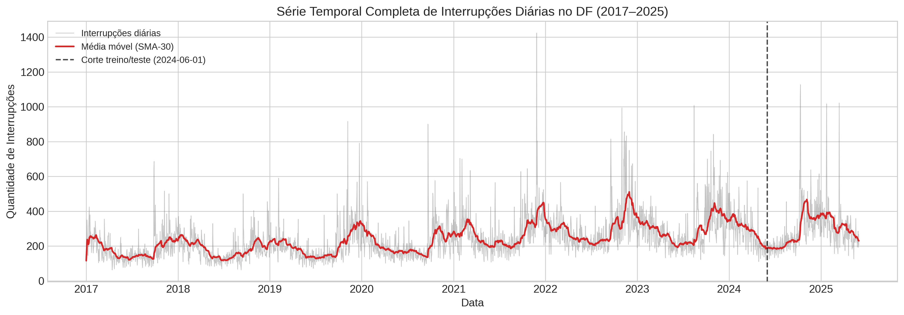
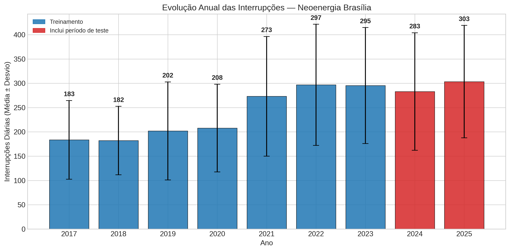
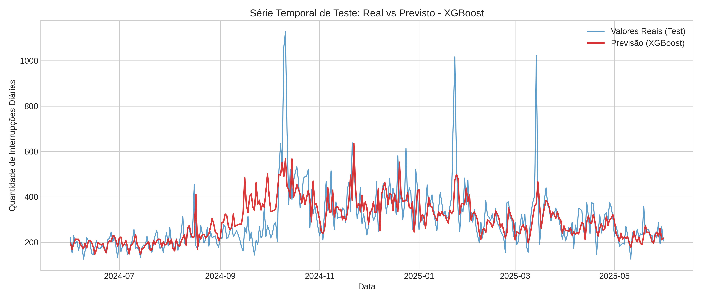
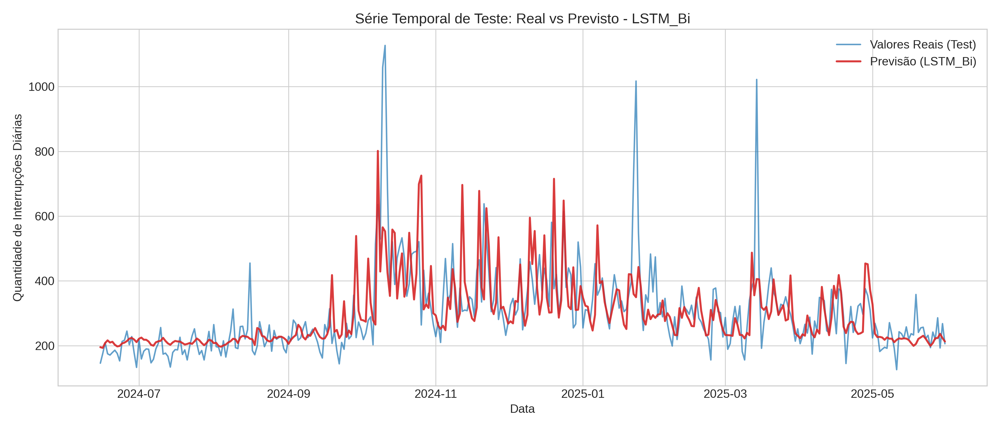
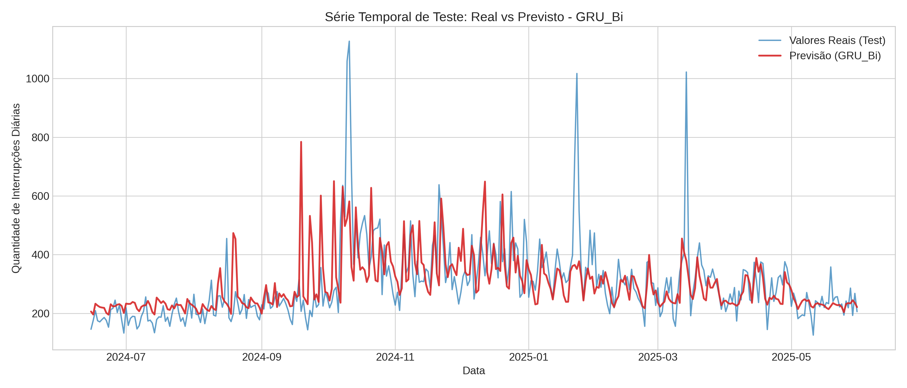

# Respostas às dúvidas do Prof. Jan — 21/05/2026

---

## Fig 4.1 — Qual foi o período de teste?



O período de teste corresponde aos **últimos 365 dias do dataset**, de **01/06/2024 a 31/05/2025**. O corte não foi definido por data calendário, mas por número de dias (`test_size_days = 365`). A linha tracejada na figura marca exatamente esse ponto.

```python
# baseline_xgboost.py — linhas 36–48
def load_and_split_data(filepath, target_col='interrupcoes', test_size_days=365):
    df = pd.read_csv(filepath, index_col='data', parse_dates=True)
    split_index = len(df) - test_size_days
    X_train, X_test = X.iloc[:split_index], X.iloc[split_index:]
    y_train, y_test = y.iloc[:split_index], y.iloc[split_index:]
```

Na prática, ao carregar o dataset de features (3.058 dias após o `dropna` dos lags):

```
Treino: 2.693 dias  |  08/01/2017 → 31/05/2024
Teste:    365 dias  |  01/06/2024 → 31/05/2025
```

---

## Fig 4.2 — Usaram 2024 e 2025 inteiros para teste?

Não. O ano de **2024 está dividido**:

- Jan/2024 – Mai/2024 → treino
- Jun/2024 – Dez/2024 → teste
- Jan/2025 – Mai/2025 → teste

As barras de 2024 e 2025 aparecem vermelhas porque a legenda indica "período que **inclui** dados de teste" — não que o ano inteiro pertence ao teste.



```
Treino:  2.693 dias  |  08/01/2017 → 31/05/2024   ← 2024 começa no treino
Teste:     365 dias  |  01/06/2024 → 31/05/2025   ← 2024 termina no teste
```

---

## Figs 4.20 a 4.22 — Como foi a divisão treino/teste?

Os três gráficos mostram **somente o conjunto de teste** (365 dias: 01/06/2024–31/05/2025). A divisão é a mesma para todos os modelos:

| Partição | Dias  | Período                 |
|----------|-------|-------------------------|
| Treino   | 2.693 | 08/01/2017 → 31/05/2024 |
| Teste    | 365   | 01/06/2024 → 31/05/2025 |







---

## Figs 4.20 a 4.22 — Motivo dos picos nos valores reais?

Os cinco maiores picos do período de teste, cruzados com os dados climáticos do INMET:

| Data       | Interrupções | Precipitação (mm) | Rajada máx. (m/s) |
|------------|-------------|-------------------|-------------------|
| 2024-10-11 | 1.127       | 5,0               | 13,3              |
| 2024-10-10 | 1.059       | 1,0               | 11,1              |
| 2025-03-14 | 1.022       | 38,4              | 11,4              |
| 2025-01-23 | 1.017       | 6,8               | 18,6              |
| 2025-01-22 | 734         | 0,0               | 15,1              |

Os eventos de **22–23/jan/2025** têm rajadas de 15,1 e 18,6 m/s — acima do limiar de 15 m/s associado a altos volumes de falhas na Fig 4.11 da monografia, e coerentes com a relação quadrática $F_D \propto v^2$. O evento de **14/mar/2025** tem 38,4 mm de precipitação em um único dia, típico do final do verão brasiliense.

Os picos de **10–11/out/2024** são os mais severos (acima de 1.000) e ocorrem no início da estação chuvosa, com leituras moderadas na estação INMET. Isso é esperado: tempestades convectivas do cerrado são espacialmente localizadas e podem atingir múltiplas subestações sem gerar leituras extremas em um único ponto de medição. Essa variabilidade espacial é parte do que torna esses eventos difíceis de prever com dados de uma única estação meteorológica.

---

## Em algum modelo, dados de treino foram usados para teste?

Não. O cuidado com isso foi central no pipeline.

Para os modelos de deep learning, o `MinMaxScaler` é ajustado **exclusivamente** nos dados de treino e apenas aplicado ao teste:

```python
# data_loader_dl.py — linhas 37–39
scaler = MinMaxScaler()
train_scaled = scaler.fit_transform(train_df)  # aprende min/max só do treino
test_scaled  = scaler.transform(test_df)       # aplica sem reajustar
```

Para o XGBoost, o modelo vê apenas `X_train` e `y_train` no `.fit()`, e o conjunto de teste nunca é exposto antes da avaliação final.

As features de lag (t-1, t-2, t-3, t-7) e EMA são calculadas sobre toda a série antes do split, mas isso não representa vazamento: cada valor de lag usa apenas informação passada em relação ao dia previsto — exatamente o que estaria disponível num cenário real de previsão.

---

## Seria possível fazer um modelo que usa todos os dados menos os últimos 3 dias e prevê apenas esses 3 dias?

Sim, é possível. O que o professor está descrevendo é uma **previsão multi-step com horizonte fixo de 3 dias**, diferente do modelo atual que faz previsão de 1 dia por vez ao longo de 365 dias.

As principais diferenças em relação ao que foi feito:

| Aspecto         | Modelo atual                         | Modelo proposto                          |
|-----------------|--------------------------------------|------------------------------------------|
| Horizonte       | 1 dia à frente (t+1)                 | 3 dias simultâneos (t+1, t+2, t+3)      |
| Conjunto de teste | 365 dias                           | 3 dias (os 3 finais do dataset)          |
| Saída do modelo | 1 valor                              | 3 valores                                |

Na prática, para o XGBoost seria necessário treinar 3 modelos independentes (um por horizonte) ou usar `MultiOutputRegressor`. Para LSTM e GRU, a camada de saída mudaria de `Linear(hidden, 1)` para `Linear(hidden, 3)`.

Isso seria tecnicamente viável, mas demandaria alterações significativas no pipeline de treinamento, avaliação e nos gráficos — e consequentemente em boa parte do Capítulo 4 da monografia. Dado o quanto já avançamos, ficaria mais natural como um trabalho futuro, a menos que o professor considere isso um bloco adicional necessário para a aprovação do TCC.

---

## Como funciona em relação à localização? Tem regiões com maior tendência?

Os dados utilizados são **agregados para todo o DF** — o total diário de interrupções em toda a área de concessão da Neoenergia Brasília. O dataset não tem coluna de localidade, subestação ou região administrativa:

```
data | interrupcoes | temperatura_media | precipitacao_total_mm |
vento_velocidade_media_ms | vento_velocidade_max_ms | vento_rajada_max_ms |
vento_direcao_media_gr | vento_direcao_moda_gr | n_registros
```

O modelo prevê esse total agregado e não distingue regiões. Uma análise por localização exigiria dados da ANEEL no nível de circuito ou alimentador (disponíveis no SARDH/SAFDI), que não são de acesso público irrestrito e estavam fora do escopo deste trabalho.
